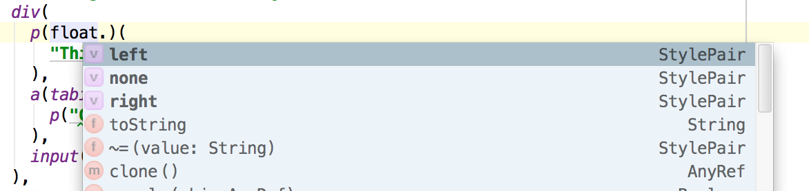
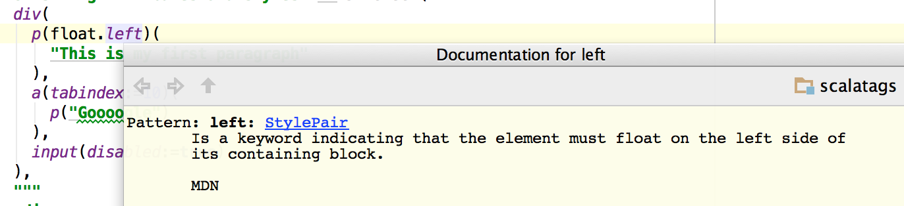
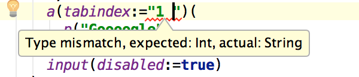

ScalaTags
=========

ScalaTags is a small XML/HTML construction library for [Scala](http://www.scala-lang.org/) that takes fragments in plain Scala code that look like this:

```scala
html(
  head(
    script(src:="..."),
    script(
      "alert('Hello World')"
    )
   ),
  body(
    div(
      h1(id:="title", "This is a title"),
      p("This is a big paragraph of text")
    )
  )
)
```

And turns them into HTML like this:

```html
<html>
    <head>
        <script src="..." />
        <script>alert('Hello World')</script>
    </head>
    <body>
        <div>
            <h1 id="title">This is a title</h1>
            <p>This is a big paragraph of text</p>
        </div>
    </body>
</html>
```

Getting Started
===============

ScalaTags is hosted on [Maven Central](http://search.maven.org/#artifactdetails%7Ccom.scalatags%7Cscalatags_2.10%7C0.1.4%7Cjar); to get started, simply add the following to your `build.sbt`:

```scala
libraryDependencies += "com.scalatags" % "scalatags_2.10" % "0.2.0"
```

And you're good to go! Open up a `sbt console` and you can start working through the [Examples](#Examples), which should just work when copied and pasted into the console, or browse the [Scaladoc](http://lihaoyi.github.io/scalatags/#package).

ScalaJS
=======

ScalaTags now works out-of-the-box with [Scala.js](http://www.scala-js.org/). The folder ```scalatags-js``` includes an alternate SBT project that builds with ScalaJS.

To use Scalatags with a ScalaJS project, check out this project Just put a source dependency on the the `/scalatags-js` folder from your own project. This manual process should improve when ScalaJS's package management story is more mature.


Why ScalaTags
=============

The core functionality of Scalatags is less than 500 lines of code, and yet it provides all the functionality of large frameworks like Python's [Jinja2](http://jinja.pocoo.org/docs/sandbox/) or C#'s [Razor](http://msdn.microsoft.com/en-us/vs2010trainingcourse_aspnetmvc3razor.aspx).

It does this by leveraging the functionality of the Scala language to do almost *everything*. A lot of different language constructs can be used to help keep your templates concise and [DRY](http://en.wikipedia.org/wiki/Don't_repeat_yourself), and why re-invent them all yourself when you have someone else who has done it before you.

ScalaTags is inspired by the Play! Framework's [Twirl templates](https://github.com/spray/twirl), and ASP.NET's [Razor templates](http://msdn.microsoft.com/en-us/vs2010trainingcourse_aspnetmvc3razor.aspx). Like those, it takes the view that it is better to re-use the host language in your templates, rather than try to invent your own mini-language. Unlike Twirl and Razor, ScalaTags is an embedded DSL, not requiring any special parser or build step.

Since ScalaTags is pure Scala. This means that any IDE which understands Scala will understand ScalaTags. Not only do you get syntax highlighting, you also get code completion:



and Error Highlighting:


and in-editor documentation:



And all the other good things (<em>jump to definition</em>, *extract method*, etc.) you're used to in a statically typed language. No more messing around in templates which mess up the highlighting of your HTML editor, or waiting months for the correct plugin to materialize.

Although other templating systems also perform static validation, Scalatags is able to statically check the templates to a much greater degree than any external templating engine. For example, we can apply static constraints to a number of HTML attributes and CSS rules:



Making them fail to compile if you accidentally pass the wrong thing in.

Take a look at the [prior work](#prior-work) section for a more detailed analysis of Scalatags in comparison to other popular libraries.

Basic Examples
==============

This is a bunch of simple examples to get you started using ScalaTags. These examples are all in the [unit tests](src/test/scala/scalatags/ExampleTests.scala).

Hello World
-----------

```scala
import scalatags._

val frag = html(
  head(
    script("some script")
  ),
  body(
    h1("This is my title"),
    div(
      p("This is my first paragraph"),
      p("This is my second paragraph")
    )
  )
)
```

The core of Scalatags is a way to generate (X)HTML fragments using plain Scala. This example code creates a Scalatags fragment. We could do many things with a fragment: store it, return it, it's just a normal Scala value. Eventually, though, you will want to convert it into HTML. To do this, simply use:

```scala
frag.toString
```

Which will give you a String containing the HTML representation:

```html
<html><head><script>some script</script></head><body><h1>This is my title</h1><div><p>This is my first paragraph</p><p>This is my second paragraph</p></div></body></html>
```

This representation omits unnecesary whitespace. To improve readability we could pretty print it using some XML processing:

```scala
val prettier = new scala.xml.PrettyPrinter(80, 4)
println(prettier.format(scala.xml.XML.loadString(frag.toString)))
```

executing that prints out:

```html
<html>
    <head>
        <script>some script</script>
    </head>
    <body>
        <h1>This is my title</h1>
        <div>
            <p>This is my first paragraph</p>
            <p>This is my second paragraph</p>
        </div>
    </body>
</html>
```

The following examples will simply show the initial Scalatag fragment and the final prettyprinted HTML, skipping the intermediate steps.

Attributes
----------

```scala
html(
  head(
    script("some script")
  ),
  body(
    h1("This is my title"),
    div(
      p(onclick:="... do some js")(
        "This is my first paragraph"
      ),
      a(href:="www.google.com")(
        p("Goooogle")
      )
    )
  )
)
```

In Scalatags, each attribute has an associated value which can be used to set it. This example shows you set the `onclick` and `href` attributes with the `:=` operator.

The common HTML attributes all have static values to use in your fragments. This keeps things concise and statically checked. However, inevitably you'll want to set some attribute which isn't in the initial list defined by Scalatags. This can be done with the `.attr` method that Scalatags adds to Strings:

```scala
html(
  head(
    script("some script")
  ),
  body(
    h1("This is my title"),
    div(
      p("onclick".attr:="... do some js")(
        "This is my first paragraph"
      ),
      a("href".attr:="www.google.com")(
        p("Goooogle")
      )
    )
  )
)
```

If you wish to, you can also take the result of the `.attr` call and assign it to a variable for you to use later in an identical way. Both of these print the same thing:

```html
<html>
    <head>
        <script>some script</script>
    </head>
    <body>
        <h1>This is my title</h1>
        <div>
            <p onclick="... do some js">
                This is my first paragraph
            </p>
            <a href="www.google.com">
                <p>Goooogle</p>
            </a>
        </div>
    </body>
</html>
```

CSS & Classes
-------------

```scala
val contentpara = "contentpara".cls
val first = "first".cls
html(
  head(
    script("some script")
  ),
  body(
    h1(backgroundColor:="blue", color:="red")("This is my title"),
    div(backgroundColor:="blue", color:="red")(
      p(contentpara, first)(
        "This is my first paragraph"
      ),
      a(opacity:=0.9)(
        p("contentpara".cls)("Goooogle")
      )
    )
  )
)
```

In HTML, the `class` and `style` attributes are often thought of not as normal attributes (which contain strings), but as lists of strings (for `class`) and lists of key-value pairs (for `style`). Furthermore, there is a large but finite number of styles, and not any arbitrary string can be a style. The above example shows how CSS classes and inline-styles are typically set.

Note that in this case, `backgroundColor`, `color`, `contentpara`, `first` and `opacity` are all statically typed identifiers. The two CSS classes `contentpara` and `first` are defined just before, while `backgroundColor`, `color` and `opacity` are [defined by Scalatags](src/main/scala/scalatags/Styles.scala).

Scalatags also provides a way of setting styles dynamically as strings. This example shows how to define your own styles or css classes inline:

```scala
html(
  head(
    script("some script")
  ),
  body(
    h1("background-color".style:="blue", "color".style:="red")("This is my title"),
    div("background-color".style:="blue", "color".style:="red")(
      p("contentpara".cls, "first".cls)(
        "This is my first paragraph"
      ),
      a("opacity".style:="0.9")(
        p("contentpara".cls)("Goooogle")
      )
    )
  )
)
```

Again, you can take the result of `.style` or `.cls` and assign them to variables, allowing you to use them in multiple places without having to copy the stringly-typed, verbose declaration each time. Both of these print the same thing:

```html
<html>
    <head>
        <script>some script</script>
    </head>
    <body>
        <h1 style="background-color: blue; color: red;">This is my title</h1>
        <div style="background-color: blue; color: red;">
        <p class="contentpara first">This is my first paragraph</p>
        <a style="opacity: 0.9;">
            <p class="contentpara">Goooogle</p>
        </a>
        </div>
    </body>
</html>
```

A full list of the shortcut methods (for both attributes and styles) provided by ScalaTags can be found in [HtmlAttributes.scala](src/main/scala/scalatags/HtmlAttributes.scala) and [Styles.scala](src/main/scala/scalatags/Styles.scala). This of course won't include any which you define yourself.


Non-String Attributes and Styles
================================

```scala
div(
  p(float.left)(
    "This is my first paragraph"
  ),
  a(tabindex:=10)(
    p("Goooogle")
  ),
  input(disabled:=true)
)
```

Not all attributes and styles take strings; some, like `float`, have an enumeration of valid values, and can be referenced by `float.left`, `float.right`, etc.. Others, like `tabindex` or `disabled`, take Ints and Booleans respectively. These are used directly as shown in the example above. Attempts to pass in strings to `float:=`, `tabindex:=` or `disabled:=` result in compile errors.

If you for some reason really need to pass in a special value for one of these attributes or styles (e.g. you have a Javascript library that parses these values and does some magic) you can either use the `.attr` and `.style` extensions shown earlier to create versions of `float`, `tabindex` or `disabled` which takes Strings, or you can use the `~=` operator to force assignment:

```scala
div(
  p(float~="left")(
    "This is my first paragraph"
  ),
  a(tabindex~="10")(
    p("Goooogle")
  ),
  input(disabled~="true")
)
```

Both of these print the same thing:

```html
<div>
    <p style="float: left;">This is my first paragraph</p>
    <a tabindex="10">
        <p>Goooogle</p>
    </a>
    <input disabled="true" />
</div>
```

In general, the `~=` operator should need need to be used very often, as only a conservative subset of attributes and styles provide non-string typechecking, those that take a well-defined set of values that falls nicely within some other data-type. Nonetheless, it is there as an escape hatch should you need it.

More Attributes and Styles
===============================================

```scala
div(
  div(backgroundColor:=hex"ababab"),
  div(color:=rgb(0, 255, 255)),
  div(color.red),
  div(borderRightColor:=hsla(100, 0, 50, 0.5)),
  div(backgroundImage:=radialGradient(hex"f00", hex"0f0"~50.pct, hex"00f")),
  div(backgroundImage:=url("www.picture.com/my_picture")),
  div(backgroundImage:=(
    radialGradient(45.px, 45.px, "ellipse farthest-corner", hex"f00", hex"0f0"~500.px, hex"00f"),
    linearGradient("to top left", hex"f00", hex"0f0"~10.px, hex"00f")
  ))
)
```

Due to the irregular nature of CSS syntax, Scalatag's static bindings are not always
uniform. The above snippet shows an spread of the static bindings Scalatags provides:

- `hex"..."` to define colors
- `color.red` syntax, similar to `float.left` used elsewhere in this document
  to define bindings to enum values.
- The `hsla`, `url` and other functions, which provide a concise and
  typesafe wrappers for their respective CSS declarations

In general, this is the range of techniques to try when you want to define a
CSS rule and don't know how. Many of the more complex rules still take `String`s
in their `:=` method, meaning they don't have any typesafe bindings written for
them. Even for the rules which have a typesafe `:=`, if you find you need
something not provided by the typesafe wrappers, you can always use `~=` to as
an escape hatch to fall back to strings.

The above snippet renders the following HTML:

```html
<div>
    <div style="background-color: #ababab;" />
    <div style="color: rgb(0, 255, 255);" />
    <div style="color: red;" />
    <div style="border-right-color: hsla(100, 0, 50, 0.5);" />
    <div style="background-image: radial-gradient(#f00, #0f0 50%, #00f);" />
    <div style="background-image: url(www.picture.com/my_picture);" />
    <div style="background-image: radial-gradient(45px 45px, ellipse farthest-corner, #f00, #0f0 500px, #00f), linear-gradient(to top left, #f00, #0f0 10px, #00f);" />
</div>
```

Currently only a subset of attributes and styles provide this kind of non-string typechecking; that number will increase as better ways are found of rigorously typing the CSS syntax.


Additional Imports
=====================

```scala
import Styles.pageBreakBefore
import Tags.address
import SvgTags.svg
import SvgStyles.stroke
div(
  p(pageBreakBefore.always, "a long paragraph which should not be broken"),
  address("500 Memorial Drive, Cambridge MA"),
  svg(stroke:="blue")
)
```

By default, only a subset of tags, attributes and styles are imported, which correspond to the most commonly-used tags, attributes and styles. This is done to balance the convenience of having everything available at hand with the pollution of dumping everything into your global namespace.

Additional tags can be found in:

- __Styles__: additional CSS Styles
- __Tags__: additional Tags
- __SvgTags__: tags related to SVG images
- __SvgStyles__: styles related to SVG images.

The above example prints:

```scala
<div>
    <p style="page-break-before: always;">
        a long paragraph which should not be broken
    </p>
    <address>500 Memorial Drive, Cambridge MA</address>
    <svg style="stroke: blue;" />
</div>
```

Variables
=========

```scala
val title = "title"
val numVisitors = 1023

html(
  head(
    script("some script")
  ),
  body(
    h1("This is my ", title),
    div(
      p("This is my first paragraph"),
      p("you are the ", numVisitors.toString, "th visitor!")
    )
  )
)
```

Variables can be inserted into the templates as Strings, simply by adding them to an element's children. This prints

```html
<html>
    <head>
        <script>some script</script>
    </head>
    <body>
        <h1>This is my title</h1>
        <div>
            <p>This is my first paragraph</p>
            <p>you are the 1023th visitor!</p>
        </div>
    </body>
</html>
```

Control Flow
------------

```scala
val numVisitors = 1023
val posts = Seq(
  ("alice", "i like pie"),
  ("bob", "pie is evil i hate you"),
  ("charlie", "i like pie and pie is evil, i hat myself")
)

html(
  head(
    script("some script")
  ),
  body(
    h1("This is my title"),
    div("posts"),
    for ((name, text) <- posts) yield div(
        h2("Post by ", name),
        p(text)
    ),
    if(numVisitors > 100) p("No more posts!")
    else p("Please post below...")
  )
)
```

Like most other XML templating languages, ScalaTags contains control flow statements like `if` and `for`. Unlike other templating languages which have their own [crufty little programming language embedded inside them for control flow](http://jinja.pocoo.org/docs/templates/#list-of-control-structures), you probably already know how to use ScalaTags' control flow syntax. They're just Scala after all.

This prints out:

```html
<html>
    <head>
        <script>some script</script>
    </head>
    <body>
        <h1>This is my title</h1>
        <div>posts</div>
        <div>
            <h2>Post by alice</h2>
            <p>i like pie</p>
        </div>
        <div>
            <h2>Post by bob</h2>
            <p>pie is evil i hate you</p>
        </div>
        <div>
            <h2>Post by charlie</h2>
            <p>i like pie and pie is evil, i hat myself</p>
        </div>
        <p>No more posts!</p>
    </body>
</html>
```

Functions
---------

```scala
def imgBox(source: String, text: String) = div(
  img(src:=source),
  div(
    p(text)
  )
)

html(
  head(
    script("some script")
  ),
  body(
    h1("This is my title"),
    imgBox("www.mysite.com/imageOne.png", "This is the first image displayed on the site"),
    div(`class`:="content")(
      p("blah blah blah i am text"),
      imgBox("www.mysite.com/imageTwo.png", "This image is very interesting")
    )
  )
)
```

Many other templating systems define [incredibly](http://guides.rubyonrails.org/layouts_and_rendering.html#using-partials) [roundabout](http://jinja.pocoo.org/docs/templates/#macros) ways of creating re-usable parts of the template. In ScalaTags, we don't need to re-invent the wheel, because Scala has these amazing things called *functions*.

The above example prints:

```html
<html>
    <head>
        <script>some script</script>
    </head>
    <body>
        <h1>This is my title</h1>
        <div>
            
            <div>
                <p>This is the first image displayed on the site</p>
            </div>
        </div>
        <div class="content">
            <p>blah blah blah i am text</p>
            <div>
                
            <div>
                <p>This image is very interesting</p>
            </div>
            </div>
        </div>
    </body>
</html>
```

Auto-escaping and unsanitized Input
-----------------------------------

```scala
val evilInput1 = "\"><script>alert('hello!')</script>"
val evilInput2 = "<script>alert('hello!')</script>"

html(
  head(
    script("some script")
  ),
  body(
    h1(
      title:=evilInput1,
      "This is my title"
    ),
    evilInput2
  )
)
```

By default, any text that's put into the Scalatags templates, whether as a attribute value or a text node, is properly escaped when it is rendered. Thus, when you run the following snippet, you get this:

```html
<html>
    <head>
        <script>some script</script>
    </head>
    <body>
        <h1 title="&quot;&gt;&lt;script&gt;alert('hello!')&lt;/script&gt;">
            This is my title
        </h1>
        &lt;script&gt;alert('hello!')&lt;/script&gt;
    </body>
</html>
```

As you can see, the contents of the variables `evilInput1` and `evilInput2` have been HTML-escaped, so you do not have to worry about un-escaped user input messing up your DOM or causing XSS injections. Furthermore, the names of the tags (e.g. "html") and attributes (e.g. "href") are themselves validated: passing in an invalid name to either of those (e.g. a tag or attribute name with a space inside) will throw an `IllegalArgumentException`).

If you *really* want, for whatever reason, to put unsanitized input into your HTML, simply surround the string with a `raw` tag:

```scala
val evilInput = "<script>alert('hello!')</script>"

html(
  head(
    script("some script")
  ),
  body(
    h1("This is my title"),
    raw(evilInput)
  )
)
```

prints

```html
<html>
    <head>
        <script>some script</script>
    </head>
    <body>
        <h1>This is my title</h1>
        <script>alert('hello!')</script>
    </body>
</html>
```

As you can see, the `<script>` tags in `evilInput` have been passed through to the resultant HTML string unchanged. Although this makes it easy to open up XSS holes (as shown above!), if you know what you're doing, go ahead.

There isn't any way to put unescaped text inside tag names, attribute names, or attribute values.

Layouts
-------

```scala
def page(scripts: Seq[Node], content: Seq[Node]) =
  html(
    head(scripts),
    body(
      h1("This is my title"),
      div("content".cls)(content)
    )
  )


page(
  Seq(
    script("some script")
  ),
  Seq(
    p("This is the first ", b("image"), " displayed on the ", a("site")),
    img(src:="www.myImage.com/image.jpg"),
    p("blah blah blah i am text")
  )
)
```

Again, this is something that many other templating languages have their own [special](http://guides.rubyonrails.org/layouts_and_rendering.html#using-nested-layouts) [implementations](http://jinja.pocoo.org/docs/templates/#template-inheritance) of. In ScalaTags, this can be done simply by just using functions! The above snippet gives you:

```html
<html>
    <head>
        <script>some script</script>
    </head>
    <body>
        <h1>This is my title</h1>
            <div class="content">
            <p>This is the first <b>image</b> displayed on the <a>site</a></p>
                
            <p>blah blah blah i am text</p>
        </div>
    </body>
</html>
```

Inheritance
-----------

```scala
class Parent{
  def render = html(
    headFrag,
    bodyFrag

  )
  def headFrag = head(
    script("some script")
  )
  def bodyFrag = body(
    h1("This is my title"),
    div(
      p("This is my first paragraph"),
      p("This is my second paragraph")
    )
  )
}

object Child extends Parent{
  override def headFrag = head(
    script("some other script")
  )
}

Child.toString
```

Most of the time, functions are sufficient to keep things DRY, if you for some reason want to use inheritance to structure your code, you probably already know how to do so. Again, unlike [other](http://wsgiarea.pocoo.org/jinja/docs/inheritance.html) [frameworks](http://docs.makotemplates.org/en/latest/inheritance.html) that have implemented complex inheritance systems themselves, Scalatags is just Scala, and it behaves as you'd expect.

```html
<html>
    <head>
        <script>some other script</script>
    </head>
    <body>
        <h1>This is my title</h1>
        <div>
            <p>This is my first paragraph</p>
            <p>This is my second paragraph</p>
        </div>
    </body>
</html>
```


Internals
=========

The bulk of Scalatag's ~5000 lines of code is static bindings (and inline documentation!) for the myriad of CSS rules and HTML tags and attributes that exist. The core of Scalatags lives in [Core.scala](), with most of the implicit extensions and conversions living in [package.scala]().

The rough architecture is as follows:

- Every node is effectively-immutable, and contains a list of `Nested` objects within it. Calling the node's apply method (e.g. `div(..., ...)`) creates a new node with the new `Nested` objects appended.
- A `Nested` can be a child-node, a attribute binding, a style binding, a css class, a `String`, or something that you define yourself.
- When a node is rendered, the list of `Nested` objects is traversed and used to populate a `children` list and `attrs` map, which are then used to render the HTML string. Each `Nested` has a `build` method that it uses to populate those data structures during rendering time. This also happens lazily when either `children` or `attrs` is called directly.
- After rendering, `children` and `attrs` are cached and the node remains effectively immutable after.

The goal of this is to avoid the performance penalty of building the data structure completely immutably, while also avoiding the correctness problems when the mutability is externally visible. By lazily deferring the actual construction until the value is needed, and then using mutation to speed things up, Scalatags optimizes for the most common use case where a tag is only rendered once, after it has finished construction, while still preserving the illusion of immutability to any external observers.

By writing custom `Nested` objects with your own `build` method, you can create "tags" that when placed into the contents of a tag, manipulates the `children` and `attrs` structures in interesting ways. Possible uses include validating that `attrs` only contains valid values for that element, or binding a [reactive variable](https://github.com/lihaoyi/scala.rx) to an attribute with enough scaffolding to propagate changes to the attribute after the page has rendered.

Prior Work
==========

Scalatags was made after experience with a broad range of HTML generation systems. This experience (with both the pros and cons of existing systems) informed the design of Scalatags.

Old-school Templates
--------------------

[Jinja2](http://jinja.pocoo.org/docs/) is the templating engine that comes bundled with [Flask](http://flask.pocoo.org/), and a similar (but somewhat weaker) system comes bundled with [Django](https://docs.djangoproject.com/en/dev/topics/templates/), and another system in a similar vein is [Ruby on Rail's ERB](http://guides.rubyonrails.org/layouts_and_rendering.html) rendering engine. This spread more-or-less represents the old-school way of rendering HTML, in that they:

- Are effectively string-based
- Use special syntax for both interpolating variables as well as for basic control flow logic
- Have a ruby/python-like (but not quite!) language for logic within the template
- Are generally with one template per file.

They also showcase many of the weaknesses of this style of templating system:

- The fact that it's string based means it's vulnerable to XSS injections, or plain-old malformed HTML output.
- The one-template-per-file rule discourages you from building your page from small re-usable fragments, because who wants to keep track of hundreds of individual files. People are reluctant to make a file with 3-5 lines in it, which is understandable but unfortunate because factoring templates into re-usable 3-5 line snippets is a good way of staying sane.
- The API is complex and novel: Jinja2 for example contains logic around [file-loading](http://jinja.pocoo.org/docs/api/#loaders) & [caching](http://jinja.pocoo.org/docs/api/#bytecode-cache), as well as custom Jinja2-specific ways of doing [loops](http://jinja.pocoo.org/docs/templates/#for), [conditionals](http://jinja.pocoo.org/docs/templates/#if), [functions](http://jinja.pocoo.org/docs/templates/#macros), [comments](http://jinja.pocoo.org/docs/templates/#comments), [inheritance](http://jinja.pocoo.org/docs/templates/#template-inheritance), [scoping](http://jinja.pocoo.org/docs/templates/#block-nesting-and-scope), [imports](http://jinja.pocoo.org/docs/templates/#import-context-behavior) and other things. All these are things you would have to learn.
- The syntax is completely new; finding a editor that properly supports all the quirks and semantics (or even simply highlighting things properly) is hard. You could hack together something quick and extremely fragile, or you could wait ages for a solid plugin to materialize.
- Abstraction is clunky: inbuilt tags are used via `<div />`, while user-defined components are called e.g. by `{{ component() }}`. You're left with a choice between not using much abstraction and mainly sticking to inbuilt tags, or creating components and accepting the fact that your templates will basically be totally composed of `{{ curly braces }}`. Neither choice is satisfying.
- Have no sort of static checking at all; you're just passing dicts around, and waiting for silly mistakes to blow up at run-time so you can fix them.

Razor and Play Templates
------------------------
[Razor](https://github.com/Antaris/RazorEngine) (the ASP.NET MVC template engine) and the Play framework's [template engine](http://www.playframework.com/documentation/2.3-SNAPSHOT/ScalaTemplates) go in a new direction. Their templates generally:

- Are statically-compiled
- Re-use large chunks of the host language

Both templating systems generally use `@` to delimit "code"; e.g. `@for(...){...}` declares a for-loop. Nice things are:

- The API is far simpler: all the custom control-flow/logic/syntax basically collapses into the simple statement "do it the way C#/Scala does it".
- Static checking in templates is nice.

However, they still have their downsides:

- Abstractions are less clunky to use than in old-school templates, e.g. `@component()` rather than `{{ component() }}`, but still not ideal.
- The one-template-per-file rule is still there, making abstractions clunky to define.
- The syntax still poses a problem for editors; both HTML editors and C#/Scala editors won't want to work with these templates, so you still end up with sub-par support or waiting for plugins.
- You still end up with weird [edge](http://stackoverflow.com/questions/13973009/complex-pattern-matching-on-templace-using-scala-play) [cases](http://stackoverflow.com/questions/12070625/compilation-error-of-play-framework-templates) due to the fact that you're squashing together two completely unrelated syntaxes.

XHP and Pyxl
------------
[XHP](https://github.com/facebook/xhp) and [Pyxl](https://github.com/dropbox/pyxl) are HTML generation systems used at Facebook and Dropbox. In short, they allow you to:

- Embed sections of your HTML as literals within your PHP and Python code
- Reference them as objects (e.g. calling methods and modifying fields)
- Provide a way to interpolate values and combine them.

The Pyxl homepage provides this example:

```python
image_name = "bolton.png"
image = 

text = "Michael Bolton"
block = <div>{image}{text}</div>

element_list = [image, text]
block2 = <div>{element_list}</div>
```

Which shows how you can generate HTML directly in your python code, using your python variables. These libraries are basically the same thing, and have some nice properties:

- The one-template-per-file rule is gone! This encourages you to make more, smaller fragments and then compose them, which is great.
- They're no longer string-based, so you won't have problems with XSS or malformed output.
- The API is really simple; maybe a dozen different things you need to remember, and the rest is "just use Python/PHP". E.g. they don't need to load templates from the filesystem any more (with all the associated discovery/loading/caching logic) since it's all just in your code.
- The syntax is completely familiar too; apart from maybe one new rule (using `{...}` to interpolate values) the rest of your templates and logic are bog-standard HTML/Python/PHP.
- Abstraction is almost seamless; both systems allow you to define custom components and have them called via `<component arg="..." />`

But they're not quite there:

- Although the syntax is familiar to you, it's not familiar to your editor, and probably will mess up your syntax highlighting (and other tooling) in your Python/PHP files.
- Defining custom components (e.g. in [Pyxl](https://github.com/dropbox/pyxl#ui-modules)) is much more verbose/tedious than it needs to be. Most of the time, all you want is a function; very rarely do you want a fragment that is long lived and has mutable state, which is where classes/objects are really necessary.
- Even using custom components gets tedious; at some scale, everything you pass into a component will be a structured Python value rather than a string, and you end up with code like `<component arg1="{value1}" arg2="{value2}" arg3="{value3}" arg4="{value4}" />`. It's nice to have inbuilt/custom components behave uniformly, but you wonder what the XML syntax is really buying you other than forcing you to only use keyword-arguments and to wrap arguments in `"{...}"`.
- It's still XML! People spend [a lot](https://github.com/visionmedia/jade) [of time](http://haml.info/) trying to get XML out of their templates; it seems odd to spend just as much time trying to put it into your source code.

Scalatags
---------

And that's why I created Scalatags:

- Structured and immune to malformed output/XSS.
- No more one-template-per-file rule; make small templates to your hearts content!
- Dead-simple API, which re-uses 100% of what you know about Scala's language and libraries.
- 100% Scala syntax; no more bumping into weird edge cases with the parser.
- Syntax highlighting, error-highlighting, jump-to-definition, in-editor-documentation, and all the other nice IDE features out of the box. No more waiting for plugins!
- Inbuilt and custom tags are uniformly just function calls (e.g. `div("hello world")`)
- Custom components are trivial to create (`def component(x: Int, y: Int) = ...`) and trivial to use (`component(value1, value2)`) because they're just functions.

On top of fixing all the old problems, Scalatags targets some new ones:

- Typesafe-ish access to HTML tags, attributes and CSS classes and styles. No more weird bugs due to typos like `flaot: left` or `<dvi>`.
- Cross compiles to run on both JVM and Javascript via [ScalaJS](https://github.com/scala-js/scala-js), which is a property few other engines (e.g. [Mustache](http://mustache.github.io/)) have.

Scalatags is still a work in progress, but I think I've hit most of the pain points I was feeling with the old systems, and hope to continually improve it over time. Pull requests welcome!

License
=======

The MIT License (MIT)

Copyright (c) 2013, Li Haoyi

Permission is hereby granted, free of charge, to any person obtaining a copy of this software and associated documentation files (the "Software"), to deal in the Software without restriction, including without limitation the rights to use, copy, modify, merge, publish, distribute, sublicense, and/or sell copies of the Software, and to permit persons to whom the Software is furnished to do so, subject to the following conditions:

The above copyright notice and this permission notice shall be included in all copies or substantial portions of the Software.

THE SOFTWARE IS PROVIDED "AS IS", WITHOUT WARRANTY OF ANY KIND, EXPRESS OR IMPLIED, INCLUDING BUT NOT LIMITED TO THE WARRANTIES OF MERCHANTABILITY, FITNESS FOR A PARTICULAR PURPOSE AND NONINFRINGEMENT. IN NO EVENT SHALL THE AUTHORS OR COPYRIGHT HOLDERS BE LIABLE FOR ANY CLAIM, DAMAGES OR OTHER LIABILITY, WHETHER IN AN ACTION OF CONTRACT, TORT OR OTHERWISE, ARISING FROM, OUT OF OR IN CONNECTION WITH THE SOFTWARE OR THE USE OR OTHER DEALINGS IN THE SOFTWARE.
